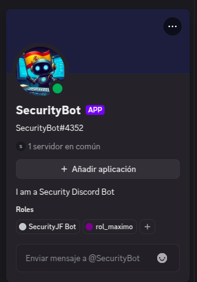
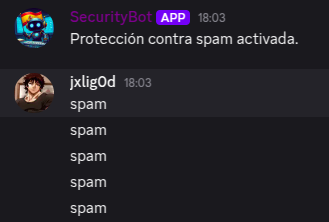
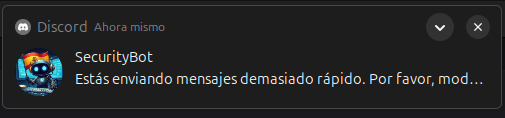
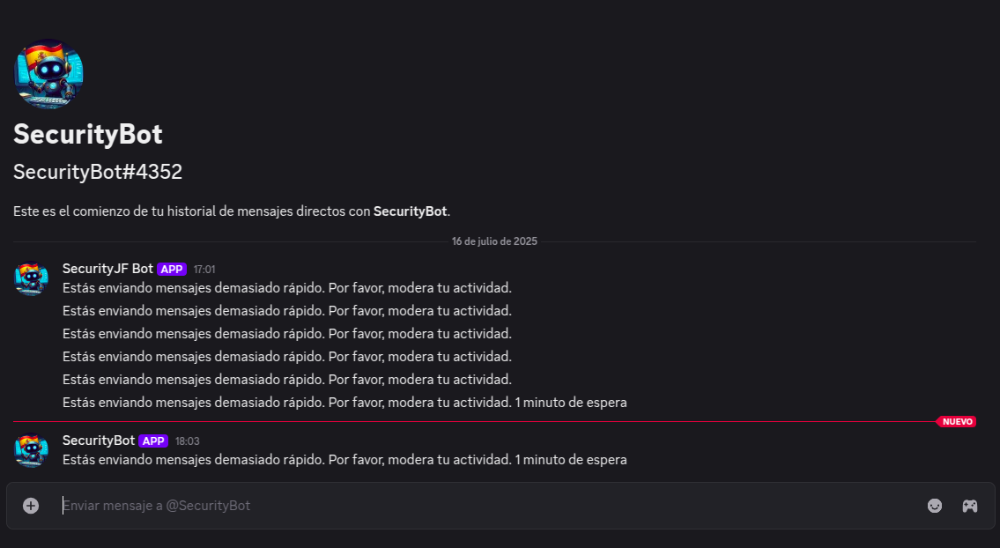
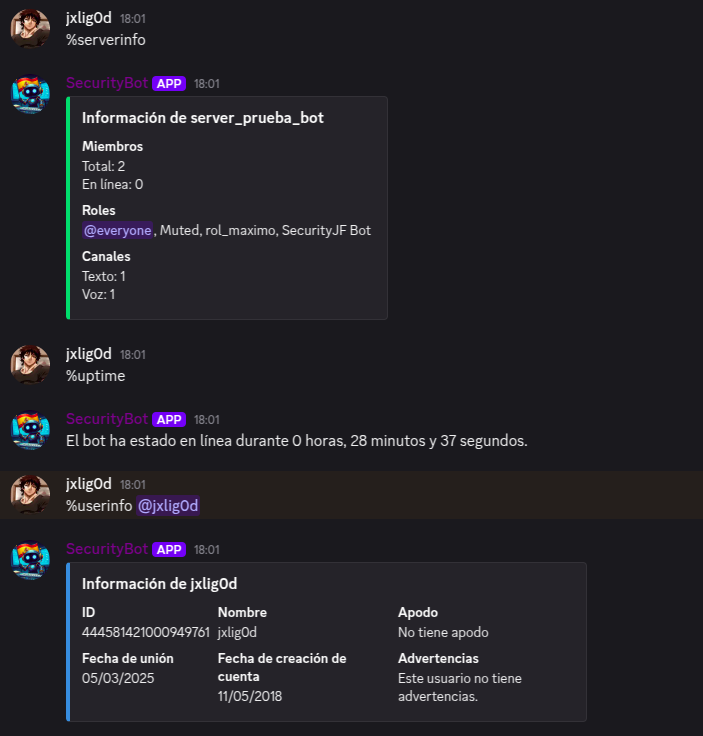
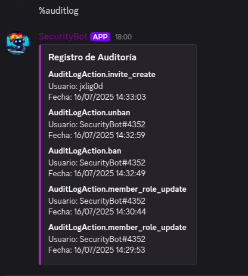
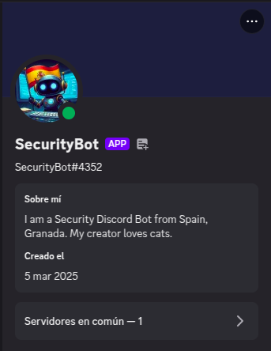

# 🚀 SSDBot (Spanish Security Discord Bot)

¡Bienvenido al repositorio de SSDBot ! Este bot está diseñado para proporcionar herramientas de seguridad y administración potentes para servidores de Discord. Con comandos para la protección contra raids, moderación avanzada como anti-spam, gestión de roles y más, **SSDBot** es la solución perfecta para mantener tu servidor seguro y bien gestionado.

## 📜 **Características**

**SSDBot** cuenta con una variedad de comandos útiles para asegurar tu servidor de Discord y hacer tareas administrativas de manera más sencilla. A continuación, te presentamos los comandos disponibles:

---

### 🔒 **Comandos de Protección**

Estos comandos ayudan a proteger tu servidor contra amenazas como raids y spam:

* `%antiraid on` — Activar la protección anti-raid.
* `%antiraid off` — Desactivar la protección anti-raid.
* `%antispam on` — Activar protección contra spam.
* `%antispam off` — Desactivar protección contra spam.

> **Advertencia:** Algunos comandos como antiraid pueden no funcionar correctamente si la base de usuarios es muy grande.

---

### 🛡️ **Comandos de Seguridad de Mensajes**

Comandos para gestionar el filtro de palabras y mantener el chat limpio:

* `%addfilter <palabra>` — Añadir una palabra a la lista de palabras prohibidas.
* `%removefilter <palabra>` — Eliminar una palabra de la lista de palabras prohibidas.
* `%removeallfilter` — Eliminar todas las palabras prohibidas.

---

### 🔐 **Comandos de Información de Seguridad**

Estos comandos te proporcionan información sobre el estado de seguridad y los logs:

* `%securitystatus` — Ver el estado de la seguridad del servidor (incluye filtros, anti-raid, etc.).
* `%securitylog` — Ver los logs de seguridad recientes.

---

### ⚙️ **Comandos de Administración del Bot**

Gestiona el estado y rendimiento del bot:

* `%reboot` — Reiniciar el bot.
* `%status` — Ver el estado del bot (online/offline).
* `%uptime` — Ver el tiempo de actividad del bot.

---

### 🧑‍💼 **Comandos de Gestión de Roles**

Comandos para gestionar los roles de los usuarios en el servidor:

* `%addrole <usuario> <rol>` — Asignar un rol a un usuario.
* `%removerole <usuario> <rol>` — Eliminar un rol de un usuario.
* `%createrole <nombre> [permisos]` — Crear un nuevo rol (sin necesidad de valor numérico).
* `%deleterole <rol>` — Eliminar un rol.

**Permisos de Rol:**

Los roles pueden incluir permisos como:

* **ADMINISTRATOR:** 8
* **KICK_MEMBERS:** 2
* **BAN_MEMBERS:** 4
* **MANAGE_ROLES:** 268435456
* **SEND_MESSAGES:** 2048
* **READ_MESSAGES:** 1048576

Y muchos más... ¡Consulta la [documentación de permisos](https://github.com/jxliian/SSDBot/blob/main/todo_comandos.txt) para más detalles! (Puedes consultarlos en mi archivo de mi repo al final, donde aparece todos los permisos con su nombre y número, aunque cuando lo uses debes de hacerlo con el nombre!)

---

### 🔨 **Comandos de Moderación General**

Herramientas para administrar y moderar el comportamiento de los usuarios en tu servidor:

* `%kick <usuario> [razón]` — Expulsar a un usuario.
* `%ban <usuario> [razón]` — Banear a un usuario.
* `%unban <usuario>` — Desbanear a un usuario.
* `%mute <usuario> [razón]` — Silenciar a un usuario.
* `%unmute <usuario>` — Desilenciar a un usuario.
* `%warn <usuario> [razón]` — Advertir a un usuario.
  * `%warnings` — Ver todas las advertencias.
  * `%clearwarns` — Eliminar todas las advertencias.
  * `%removewarning` — Eliminar una advertencia específica.
* `%clear <cantidad>` — Eliminar mensajes en el canal.

---

### 📊 **Comandos de Verificación**

Obtén información detallada sobre usuarios y servidores:

* `%userinfo <usuario>` — Mostrar información del usuario (incluyendo advertencias, bans, etc.).
* `%serverinfo` — Mostrar información sobre el servidor (miembros, roles, canales).
* `%auditlog` — Ver el registro de auditoría del servidor.

---

### 🔒 **Comandos de Seguridad de Servidor**

Comandos para gestionar la seguridad en tu servidor y canales:

* `%lockdown [canal]` — Bloquear un canal para todos excepto administradores.
* `%unlock [canal]` — Desbloquear un canal.
* `%setprefix <prefijo>` — Cambiar el prefijo del bot (algunos usuarios han reportado problemas con este comando).
* `%setlog <canal>` — Establecer un canal de registros de moderación (algunos usuarios han reportado problemas con este comando).
* `%setmod <rol>` — Establecer el rol de moderador.

---

# 📥 Instalación y Uso

## 1. Clonación del Repositorio

Primero, clona este repositorio en tu máquina local:

```bash


git clone https://github.com/tuusuario/MiBot.git

```

## 2. Instalación de Dependencias

Instala las dependencias necesarias utilizando pip:

```bash

cd MiBot
python -m venv venv
source venv/bin/activate  # En Windows usa `venv\Scripts\activate`
pip install -r requirements.txt
```

## 3. Configuración del Bot y Ejecucion

Acuerdate de poner tu token! y ejecutar el bot en local con python3.

# 🛠️ Problemas Comunes

Si encuentras algún problema o error, asegúrate de revisar lo siguiente:

* ¿Tienes todas las dependencias instaladas?
* ¿El token de Discord es correcto?
* ¿Tienes los permisos adecuados en tu servidor de Discord?

> **Advertencia:** Para que el Bot funcione correctamente debe de tener todos los permisos del servidor ;)

Si el problema persiste, abre un issue en el repositorio.

---

# 📚 Contribuciones

Si deseas contribuir a SSDBot,  puedes hacerlo siguiendo estos pasos:

1. Haz un fork del repositorio.
2. Crea una nueva rama (`git checkout -b nueva-funcionalidad`).
3. Realiza tus cambios y asegúrate de que todo funcione correctamente.
4. Haz un push a tu rama (`git push origin nueva-funcionalidad`).
5. Abre un Pull Request.

---

# 👾 ¡Disfruta usando SSDBot!

Si tienes alguna duda o sugerencia, no dudes en abrir un issue en el repositorio o enviarme un mensaje. Mi información de contacto:

# 📞 Información de Contacto

Si necesitas ayuda o tienes alguna pregunta, puedes contactarnos de las siguientes maneras:

- **Correo Electrónico**: [e.carrionjuliann@go.ugr.es](e.carrionjulian@go.ugr.es)
- **GitHub**: [https://github.com/jxliian](https://github.com/jxliian)

No dudes en ponerte en contacto con nosotros si tienes alguna duda o sugerencia. ¡Estamos aquí para ayudarte!

---

# 🌐 Contribuye al proyecto

¡Sígueme en GitHub y contribuye a que SSDBot sea aún mejor! 💡









---

# 🚀 SSDBot (Spanish Security Discord Bot) - ENGLISH AI TRANSLATION

Welcome to the SSDBot repository! This bot is designed to provide powerful security and administration tools for Discord servers. With commands for raid protection, advanced moderation like anti-spam, role management, and more, **SSDBot** is the perfect solution to keep your server secure and well-managed.

## 📜 **Features**

**SSDBot** includes a variety of useful commands to secure your Discord server and make administrative tasks easier. Here are the available commands:

---

### 🔒 **Protection Commands**

Commands to protect your server from raids and spam:

* `%antiraid on` — Enable anti-raid protection.
* `%antiraid off` — Disable anti-raid protection.
* `%antispam on` — Enable anti-spam protection.
* `%antispam off` — Disable anti-spam protection.

> **Warning:** Some commands like anti-raid may not work properly on large user bases.

---

### 🛡️ **Message Security Commands**

Commands to manage word filters and keep the chat clean:

* `%addfilter <word>` — Add a word to the banned list.
* `%removefilter <word>` — Remove a word from the banned list.
* `%removeallfilter` — Remove all banned words.

---

### 🔐 **Security Info Commands**

Commands to provide information about server security and logs:

* `%securitystatus` — View the security status of the server (includes filters, anti-raid, etc.).
* `%securitylog` — View recent security logs.

---

### ⚙️ **Bot Administration Commands**

Commands to manage the bot's status and performance:

* `%reboot` — Restart the bot.
* `%status` — Check bot status (online/offline).
* `%uptime` — Check bot uptime.

---

### 🧑‍💼 **Role Management Commands**

Commands to manage user roles in your server:

* `%addrole <user> <role>` — Assign a role to a user.
* `%removerole <user> <role>` — Remove a role from a user.
* `%createrole <name> [permissions]` — Create a new role (no numeric value required).
* `%deleterole <role>` — Delete a role.

**Role Permissions:**

Roles can include permissions such as:

* **ADMINISTRATOR:** 8
* **KICK_MEMBERS:** 2
* **BAN_MEMBERS:** 4
* **MANAGE_ROLES:** 268435456
* **SEND_MESSAGES:** 2048
* **READ_MESSAGES:** 1048576

For more details, check the [permission documentation](https://github.com/jxliian/SSDBot/blob/main/todo_comandos.txt).

---

### 🔨 **General Moderation Commands**

Tools to manage and moderate user behavior in your server:

* `%kick <user> [reason]` — Kick a user.
* `%ban <user> [reason]` — Ban a user.
* `%unban <user>` — Unban a user.
* `%mute <user> [reason]` — Mute a user.
* `%unmute <user>` — Unmute a user.
* `%warn <user> [reason]` — Warn a user.
  * `%warnings` — View all warnings.
  * `%clearwarns` — Clear all warnings.
  * `%removewarning` — Remove a specific warning.
* `%clear <amount>` — Delete messages in the channel.

---

### 📊 **Verification Commands**

Get detailed information about users and servers:

* `%userinfo <user>` — Show user information (including warnings, bans, etc.).
* `%serverinfo` — Show server information (members, roles, channels).
* `%auditlog` — View server audit logs.

---

### 🔒 **Server Security Commands**

Commands to manage server and channel security:

* `%lockdown [channel]` — Lock a channel for everyone except admins.
* `%unlock [channel]` — Unlock a channel.
* `%setprefix <prefix>` — Change the bot's prefix (some users report issues with this command).
* `%setlog <channel>` — Set a moderation log channel (some users report issues with this command).
* `%setmod <role>` — Set the moderator role.

---

# 📥 Installation and Usage

* You can check the following steps in Spanish, its just executing the commands :)

---

# 🛠️ Common Issues

If you encounter any issues or errors, make sure to check:

    Have you installed all the dependencies?

    Is the Discord token correct?

    Do you have the required permissions in your Discord server?

    Warning: The bot needs all server permissions to work correctly. 😉

If the problem persists, open an issue in the repository.

---

# 📚 Contributions

If you want to contribute to SSDBot, you can follow these steps:

    Fork the repository.

    Create a new branch (git checkout -b new-feature).

    Make your changes and make sure everything works.

    Push your branch (git push origin new-feature).

    Open a Pull Request.

---

# 👾 Enjoy using SSDBot!

If you have any questions or suggestions, feel free to open an issue in the repository or contact me. My contact information:

# 📞 Contact Information

If you need help or have any questions, you can reach us through:

- **Email**: [e.carrionjuliann@go.ugr.es](e.carrionjulian@go.ugr.es)
- **GitHub**: [https://github.com/jxliian](https://github.com/jxliian)

Feel free to contact us if you have any doubts or suggestions. We're here to help!

---

# 🌐 Contribute to the project

Follow me on GitHub and help make SSDBot even better! 💡
